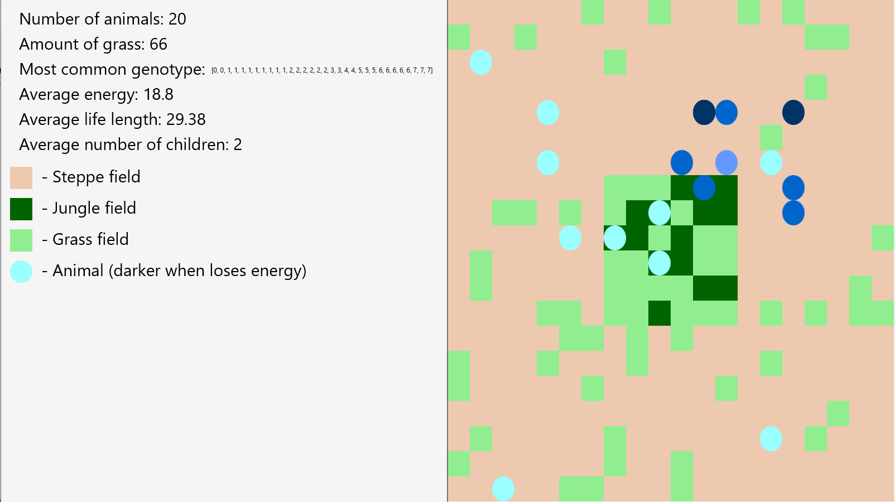

# Project Name
Game of Life

## Table of contents
* [General info](#general-info)
* [Screenshots](#screenshots)
* [Technologies](#technologies)
* [Setup](#setup)
* [Features](#features)
* [Status](#status)
* [Inspiration](#inspiration)
* [Contact](#contact)

## General info
Game of Life is a cell automaton simulation written in Java. It creates a rectangle 2d environment with periodic boundary conditions. Animals live, move, eat, reproduce and die while the user is able to follow the statistics of the simulation.

## Screenshots

## Technologies
Java,
JavaFX,
JSON

## Setup
Simulation is run with Main. Please refer to Manual.md for more instructions.

## Features
-Rectangle map with periodic boundary conditions
-Jungle in the center, every day two plants grow, one in the jungle and one outside
-Every animal has its energy, when it reaches 0 the animal dies. Animal gets more energy after consuming plants. Certain energy level is necessary to reproduce
-Every animal has its genotype, that influences the direction it is likely to go every day (each animal performs a move by 1 every day)
-Children receive genotypes based on their parents

The user is able to track:
	-number of animals
	-number of plants
	-most common genotype
	-average animal energy level
	-average lifespan of dead animals
	-average number of children for living animals
The user can also pause the simulation by pressing SPACE.

After certain amount of days specified by the user (default = 150), the simulation will save the statistics to a text file (e.x. 'statistics after 150 days.txt')

To-do list:
-multiple parallel simulations
-tracking of a specified animal

## Status
Finished

## Inspiration
https://github.com/apohllo/obiektowe-lab/tree/master/proj1
This was a student project for "Programowanie Obiektowe" (Object-oriented programming) AGH, Masters studies

